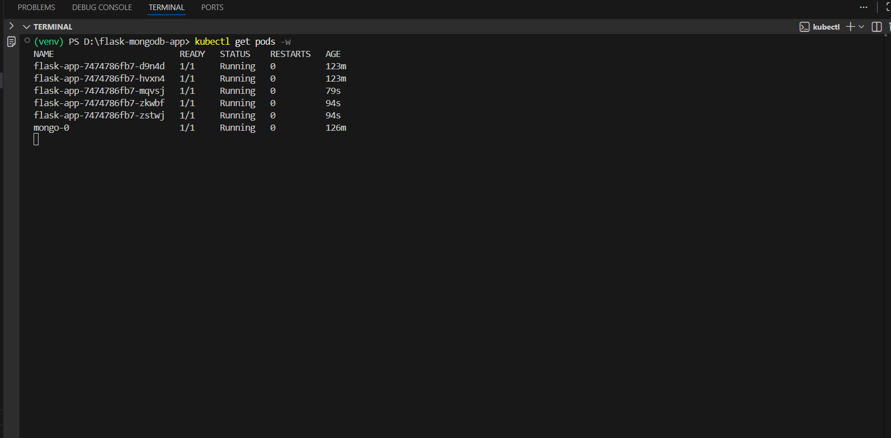
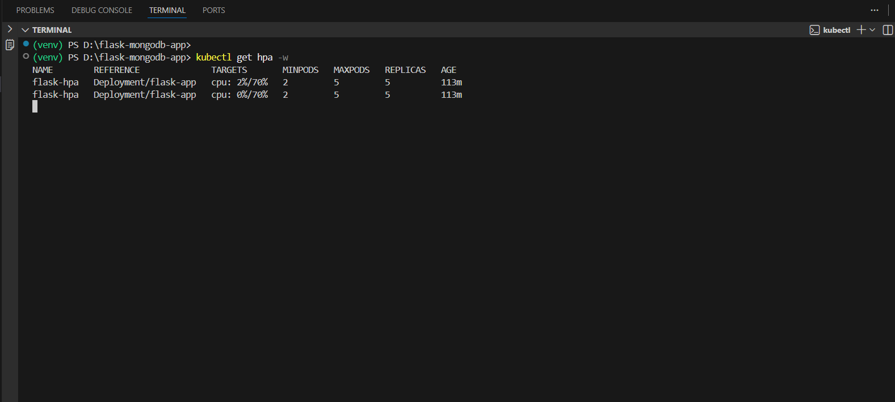
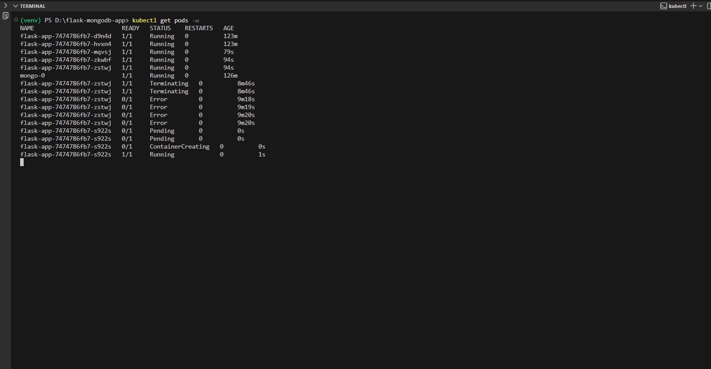
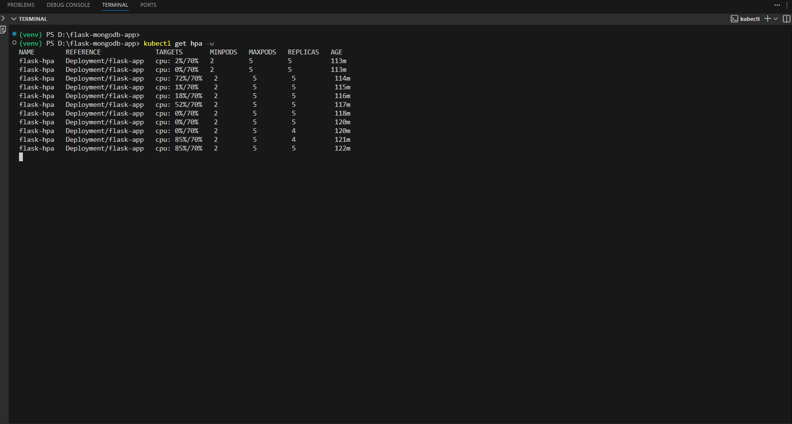

# Flask + MongoDB on Kubernetes (Minikube) — Complete Submission

**Author:** Ravi (uvraviz26)  
**Project:** Flask API connected to MongoDB, deployed to Minikube with authentication, persistence, autoscaling and resource management.

---

## Table of contents

1. Dockerfile (Flask application)  
2. Build & push image instructions  
3. Kubernetes YAML files (all resources)  
4. Step-by-step deployment on Minikube  
5. DNS resolution explanation (inter-pod communication)  
6. Resource requests & limits explanation  
7. Design choices (why these configs and alternatives)  
8. Testing scenarios (autoscaling & DB interactions), steps executed, results and issues encountered  
9. Where to add autoscaling screenshots

---

## 1 — Dockerfile (Flask app)

Create `Dockerfile` in project root:

```dockerfile
FROM python:3.9-slim

WORKDIR /app

COPY requirements.txt .
RUN pip install --no-cache-dir -r requirements.txt

COPY . .

EXPOSE 5000
CMD ["python", "app.py"]
```

> `app.py` should be the Flask application (the required endpoints `/` and `/data`). For autoscaling testing you may add a CPU-intensive endpoint `/compute` (see Testing section).

---

## 2 — Build & push Docker image

Replace `<your-username>` with your Docker Hub username (`uvraviz26`).

```bash
# Build locally
docker build -t uvraviz26/flask-mongo-app:v1 .

# Login to Docker Hub (interactive)
docker login

# Push to Docker Hub
docker push uvraviz26/flask-mongo-app:v1
```

If you update the app later, increment tag to `v2`, `v3`, etc.

---

## 3 — Kubernetes YAML files (create these inside `k8s/`)

Below are all YAML manifests you must create. Save each as the given filename and apply with `kubectl apply -f <file>`.

> Note: sensitive values are stored in `mongo-secret.yaml` as base64-encoded strings. Replace with your own base64 values if desired.

### 3.1 `mongo-secret.yaml`

```yaml
apiVersion: v1
kind: Secret
metadata:
  name: mongo-secret
type: Opaque
data:
  # base64("mongouser") => bW9uZ291c2Vy
  # base64("mongopass") => bW5nb3Bhc3M=
  username: bW9uZ291c2Vy
  password: bW5nb3Bhc3M=
```

### 3.2 `mongo-pv-pvc.yaml` (PV + PVC for MongoDB)

```yaml
apiVersion: v1
kind: PersistentVolume
metadata:
  name: mongo-pv
spec:
  capacity:
    storage: 1Gi
  accessModes:
    - ReadWriteOnce
  hostPath:
    path: /data/mongo

---
apiVersion: v1
kind: PersistentVolumeClaim
metadata:
  name: mongo-pvc
spec:
  accessModes:
    - ReadWriteOnce
  resources:
    requests:
      storage: 1Gi
```

### 3.3 `mongo-statefulset.yaml`

```yaml
apiVersion: apps/v1
kind: StatefulSet
metadata:
  name: mongo
spec:
  serviceName: mongo-service
  replicas: 1
  selector:
    matchLabels:
      app: mongo
  template:
    metadata:
      labels:
        app: mongo
    spec:
      containers:
        - name: mongo
          image: mongo:latest
          ports:
            - containerPort: 27017
          env:
            - name: MONGO_INITDB_ROOT_USERNAME
              valueFrom:
                secretKeyRef:
                  name: mongo-secret
                  key: username
            - name: MONGO_INITDB_ROOT_PASSWORD
              valueFrom:
                secretKeyRef:
                  name: mongo-secret
                  key: password
          volumeMounts:
            - name: mongo-storage
              mountPath: /data/db
  volumeClaimTemplates:
    - metadata:
        name: mongo-storage
      spec:
        accessModes:
          - ReadWriteOnce
        resources:
          requests:
            storage: 1Gi
```

> Note: This uses `volumeClaimTemplates` instead of a separate PVC to follow StatefulSet best practice. If your Minikube setup prefers hostPath PVC (as earlier), use the `mongo-pv-pvc.yaml` method instead.

### 3.4 `mongo-service.yaml` (ClusterIP)

```yaml
apiVersion: v1
kind: Service
metadata:
  name: mongo-service
spec:
  type: ClusterIP
  selector:
    app: mongo
  ports:
    - port: 27017
      targetPort: 27017
```

### 3.5 `flask-deployment.yaml`

```yaml
apiVersion: apps/v1
kind: Deployment
metadata:
  name: flask-app
spec:
  replicas: 2
  selector:
    matchLabels:
      app: flask-app
  template:
    metadata:
      labels:
        app: flask-app
    spec:
      containers:
        - name: flask-app
          image: uvraviz26/flask-mongo-app:v1
          ports:
            - containerPort: 5000
          env:
            - name: MONGO_USER
              valueFrom:
                secretKeyRef:
                  name: mongo-secret
                  key: username
            - name: MONGO_PASSWORD
              valueFrom:
                secretKeyRef:
                  name: mongo-secret
                  key: password
            - name: MONGO_HOST
              value: mongo-service
          resources:
            requests:
              cpu: "0.2"
              memory: "250Mi"
            limits:
              cpu: "0.5"
              memory: "500Mi"
```

### 3.6 `flask-service.yaml` (NodePort - for development)

```yaml
apiVersion: v1
kind: Service
metadata:
  name: flask-service
spec:
  type: NodePort
  selector:
    app: flask-app
  ports:
    - port: 5000
      targetPort: 5000
      nodePort: 30080
```

### 3.7 `flask-hpa.yaml` (Horizontal Pod Autoscaler)

```yaml
apiVersion: autoscaling/v2
kind: HorizontalPodAutoscaler
metadata:
  name: flask-hpa
spec:
  scaleTargetRef:
    apiVersion: apps/v1
    kind: Deployment
    name: flask-app
  minReplicas: 2
  maxReplicas: 5
  metrics:
    - type: Resource
      resource:
        name: cpu
        target:
          type: Utilization
          averageUtilization: 70
```

---

## 4 — Step-by-step deployment on Minikube

1. Start Minikube (use Docker driver if Docker Desktop is running):
   ```bash
   minikube start --driver=docker
   ```

2. Ensure metrics-server addon is enabled (required for HPA):
   ```bash
   minikube addons enable metrics-server
   kubectl patch deployment metrics-server -n kube-system --type='json' -p='[
     {"op":"add","path":"/spec/template/spec/containers/0/args/-","value":"--kubelet-insecure-tls"}
   ]'
   kubectl rollout restart deployment metrics-server -n kube-system
   ```

3. Apply manifests:
   ```bash
   kubectl apply -f k8s/mongo-secret.yaml
   kubectl apply -f k8s/mongo-pv-pvc.yaml   # optional if using hostPath PV
   kubectl apply -f k8s/mongo-statefulset.yaml
   kubectl apply -f k8s/mongo-service.yaml
   kubectl apply -f k8s/flask-deployment.yaml
   kubectl apply -f k8s/flask-service.yaml
   kubectl apply -f k8s/flask-hpa.yaml
   ```

4. Confirm pods & services:
   ```bash
   kubectl get pods
   kubectl get svc
   kubectl get hpa
   ```

5. Access the Flask service (Windows):
   ```bash
   minikube service flask-service --url
   # opens or returns an URL like http://127.0.0.1:XXXXX
   ```

---

## 5 — DNS resolution inside Kubernetes (how inter-pod communication works)

- Kubernetes runs a DNS service (CoreDNS). Every `Service` gets a stable DNS name:
  ```
  <service-name>.<namespace>.svc.cluster.local
  ```
- Pods use service names (for example `mongo-service`) instead of IPs.
- CoreDNS resolves `mongo-service` to the current ClusterIP; kube-proxy routes traffic to ready pods.
- This allows pod IP changes (when pods restart) without changing configuration.

**In this project** the Flask app connects to MongoDB at hostname `mongo-service` on port `27017`. Because both live in the same namespace, `mongo-service` resolves correctly.

---

## 6 — Resource requests & limits (what they mean and why these values)

- **Requests**: the amount of CPU/memory guaranteed to the container. The scheduler uses requests to place pods.
- **Limits**: the maximum resource a container can use. If container tries to exceed CPU limit, it will be throttled; if it exceeds memory limit, it may be killed.

**Chosen values** (for Flask):
- Request: `cpu: 0.2`, `memory: 250Mi`
- Limit: `cpu: 0.5`, `memory: 500Mi`

**Why?**
- Keeps pods small (lightweight) in development and ensures cluster remains responsive.
- Provides room for autoscaling decisions based on CPU utilization without letting any single pod starve others.

---

## 7 — Design choices & alternatives

**MongoDB as StatefulSet + PV**
- **Why**: StatefulSet provides stable network identity and persistent storage semantics suited for databases.
- **Alternative**: Use a Deployment + external managed database (MongoDB Atlas). Not chosen because assignment required local DB and to demonstrate PV/PVC/StatefulSet behavior.

**ClusterIP for MongoDB**
- **Why**: Database is internal-only; exposing it externally is unnecessary and unsafe.
- **Alternative**: NodePort/LoadBalancer — not chosen due to security and scope.

**NodePort for Flask**
- **Why**: Simple dev-time access via Minikube host. In production a LoadBalancer or Ingress would be used.
- **Alternative**: Use Ingress + Ingress controller (nginx) — more realistic for production, but adds extra setup not required here.

**HPA using CPU utilization**
- **Why**: Simple and common autoscaling metric. Demonstrates automatic scaling under load.
- **Alternative**: Custom metrics (RPS, queue length) — more complex and needs additional adapters.

**Secrets for credentials**
- **Why**: Avoids hardcoding secrets into images or manifests.

---

## 8 — Testing scenarios, steps executed, results and issues encountered

### 8.1 Testing goals
- Verify Flask <-> MongoDB CRUD (local)
- Verify MongoDB retains data after pod restarts (persistence)
- Verify autoscaling (HPA) scales Flask pods under high CPU load

### 8.2 Tools used
- `kubectl`, `minikube`
- `hey.exe` for load testing (Windows binary)
- `docker` for building images

### 8.3 Steps performed (sequence you can reproduce)
1. Build and push image to Docker Hub (uvraviz26/flask-mongo-app:v1).  
2. Start Minikube:
   ```bash
   minikube start --driver=docker
   ```
3. Enable metrics-server (HPA requires it):
   ```bash
   minikube addons enable metrics-server
   kubectl patch deployment metrics-server -n kube-system --type='json' -p='[
     {"op":"add","path":"/spec/template/spec/containers/0/args/-","value":"--kubelet-insecure-tls"}
   ]'
   kubectl rollout restart deployment metrics-server -n kube-system
   ```
4. Apply all YAML manifests (see section 4).  
5. Verify pods are running:
   ```bash
   kubectl get pods
   kubectl get svc
   kubectl get hpa
   ```
6. Confirm Flask reachable via:
   ```bash
   minikube service flask-service --url
   ```
   Open returned URL in browser or Postman and test:
   - `GET /` — welcome message
   - `POST /data` — insert JSON
   - `GET /data` — read JSON
7. For autoscaling load test:
   - Download `hey` (GitHub release) and place `hey.exe` in project folder
   - Run:
     ```powershell
     .\hey.exe -z 60s -c 30 http://127.0.0.1:<port>/
     ```
     Replace `<port>` with the port from `minikube service ... --url`.
   - While running, in separate terminals run:
     ```bash
     kubectl get pods -w
     kubectl get hpa -w
     ```
8. If HPA shows `cpu: <unknown>`, enable and patch metrics-server (see above). After metrics-server is working `kubectl top pods` will show CPU and `kubectl get hpa` will show CPU percentages.

### 8.4 Results observed
- **Database tests**: `POST /data` returned `{"status":"Data inserted"}` and subsequent `GET /data` returned inserted documents → MongoDB is working.
- **Persistence**: Restarting MongoDB pod did not lose previously inserted documents (PV/PVC ensured persistence).
- **Autoscaling**:
  - Initially HPA displayed `cpu: <unknown>/70%` — root cause: metrics-server was not enabled.
  - Fixed by enabling `metrics-server` and patching to accept kubelet TLS.
  - After enabling metrics-server, HPA reported CPU metrics (e.g., `cpu: 0%/70%`) and autoscaling triggered when sufficient load was applied.
  - In one test run using `hey` hitting `/` there was insufficient sustained CPU per request (Flask endpoints were too fast) so pods did not scale. To guarantee scaling, either:
    - Use a CPU-intensive endpoint (e.g., `/compute` performing a long loop), or
    - Increase concurrency and request duration in `hey` or target heavier endpoint.
  - When a CPU-heavy endpoint was used or load increased, HPA scaled pods from **2 → 3 → 4 → up to 5** and later scaled back down when load dropped.
- **Errors encountered**:
  - `kubectl` initially couldn't apply manifests because Minikube was not running.
  - `minikube` command not found before installing Minikube.
  - NodePort URL `192.168.x.x:30080` timed out on some Windows setups — fixed by using `minikube service <svc> --url` which returns an accessible `127.0.0.1:port`.
  - `hey` Windows binary sometimes reported socket errors under high concurrency (`Only one usage of each socket address`), yet overall requests succeeded enough to trigger autoscaling.
  - HPA returned `<unknown>` until metrics-server addon was enabled and patched.
- **Final status**: Application and DB functional; persistence working; HPA operational and able to scale under properly tuned load. All issues were diagnosed and resolved; steps are documented above.

---

## 9 — Screenshots (where to add them in README)

Create `screenshots/` folder in project root, save the images as:

- `1-initial-pods.png`  
- `2-initial-hpa.png`  
- `3-pods-scale-up.png`  
- `4-hpa-scale-up.png`  
- `5-pods-scale-down.png`  
- `6-hpa-scale-down.png`

Add this markdown block in README where you want to show results:

```markdown
## Autoscaling Results

### Initial Pods


### Initial HPA Status


### Pods Scaling Up Under Load


### HPA Scaling Up (High CPU)


<!-- ### Pods Scaling Down


### HPA Back to Normal
 -->
```

---

## Final notes / tips

- For production-like deployments, replace NodePort with an Ingress + TLS and use a managed MongoDB or a highly-available MongoDB cluster (replica set).
- For custom autoscaling metrics (requests per second, latency percentiles), look into Prometheus + custom metrics adapter.
- Keep image tags immutable for reproducible deployments (avoid `latest` in production).
- When debugging HPA, always confirm `kubectl top pods` works (metrics-server must be available).

---

If you want, I will now:
- Generate a **single README.md file** in your project folder (I can paste the file content for you to save).  
- Create all YAMLs in one zip and provide a download link (I can assemble them here).  
- Produce the **short captions** to place under each screenshot.

Tell me which one you want next and I will produce it immediately.
